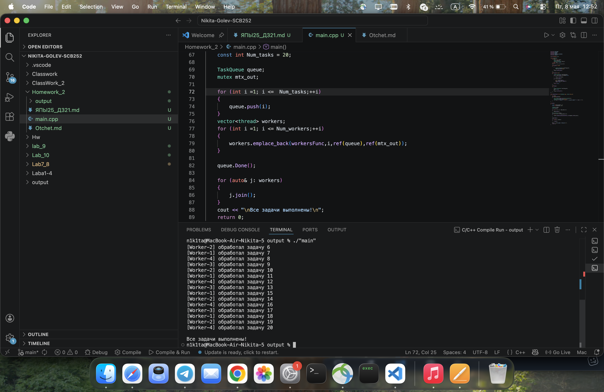

# Отчёт по домашнему заданию №21


Голев Никита Владимирович  
СКБ-252  
Дисциплина: Языки программирования  
Тема: Многопоточность в C++


## 1. Постановка задачи

Реализовать консольное приложение на C++11, моделирующее параллельную обработку задач несколькими потоками. 

## 2. Описание реализации

### Архитектура программы

Программа состоит из трёх частей:

- TaskQueue — потокобезопасная очередь задач
- workersFunc — функция рабочего потока
- main — главный поток: заполняет очередь, запускает и завершает потоки

### Потокобезопасная очередь

Класс `TaskQueue` хранит задачи в `std::vector<int>` и защищает доступ к нему через `std::mutex flag_mtx`. Перед любым изменением вектора поток берёт замок через `std::unique_lock`. Это исключает одновременный доступ нескольких потоков к общим данным и предотвращает data race.

### Использование `condition_variable`

Когда очередь пуста, рабочий поток не крутится в пустом цикле, а вызывает `flag_cv.wait(lock)` внутри цикла `while`.Когда главный поток добавляет задачу и вызывает `flag_cv.notify_one()` — один спящий рабочий просыпается, берёт замок обратно и забирает задачу.

### Механизм корректного завершения потоков

После добавления всех задач главный поток вызывает `queue.Done()`, который устанавливает флаг `done = true` и вызывает `flag_cv.notify_all()` — будит всех рабочих. Когда очередь пустеет и `done == true` — `pop()` возвращает `false`, цикл в `workersFunc` завершается и поток заканчивает работу. Главный поток ждёт каждого через `join()`.

---

## 3. Исходный код

```cpp
#include <iostream>
#include <thread>
#include <mutex>
#include <condition_variable>
#include <vector>

using namespace std;

class TaskQueue {
    private:
        vector<int> tasks;
        mutex flag_mtx;
        condition_variable flag_cv;
        bool done = false;
    public:

    void push(int task) {
        {
            unique_lock<mutex> lock(flag_mtx);
            tasks.push_back(task);
        }
        flag_cv.notify_one();
    }

    bool pop(int& out) {
        unique_lock<mutex> lock(flag_mtx);
        while (tasks.empty() && done == false) {
            flag_cv.wait(lock);
        }
        if (!tasks.empty()) {
            out = tasks.front();
            tasks.erase(tasks.begin());
            return true;
        }
        return false;
    }

    void Done() {
        {
            unique_lock<mutex> lock(flag_mtx);
            done = true;
        }
        flag_cv.notify_all();
    }
};

void workersFunc(int id, TaskQueue& que, mutex& mtx_out) {
    int task;
    while (que.pop(task)) {
        this_thread::sleep_for(chrono::seconds(1));
        unique_lock<mutex> lock(mtx_out);
        cout << "[Worker-" << id << "] обработал задачу " << task << "\n";
    }
}

int main() {
    const int Num_workers = 4;
    const int Num_tasks = 20;

    TaskQueue queue;
    mutex mtx_out;

    for (int i = 1; i <= Num_tasks; ++i) {
        queue.push(i);
    }

    vector<thread> workers;
    for (int i = 1; i <= Num_workers; ++i) {
        workers.emplace_back(workersFunc, i, ref(queue), ref(mtx_out));
    }

    queue.Done();

    for (auto& j : workers) {
        j.join();
    }

    cout << "\nВсе задачи выполнены!\n";
    return 0;
}


## 4. Демонстрация работы

**Ссылка на GitHub:** https://github.com/nikgolich-ship-it/Nikita-Golev-SCB252





## 5. Выводы

git reset HEADВ ходе работы была реализована потокобезопасная очередь задач с использованием `std::mutex` и `std::condition_variable`. Четыре рабочих потока параллельно обрабатывают 20 задач примерно за 5 секунд вместо 20 

